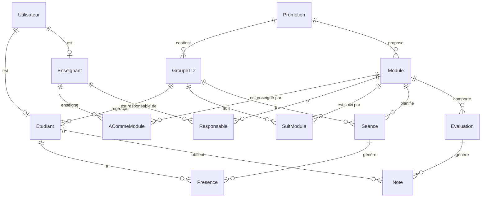

# 🎓 ScoDoc

> Application de bureau de gestion de scolarité (notes, absences, emplois du temps) développée en **Java / JavaFX**, avec une architecture **MVC + DAO** et une base de données **MySQL**.


---

## 📖 Sommaire

- [À propos](#-à-propos)
- [Fonctionnalités](#-fonctionnalités)
- [Architecture](#-architecture)
- [Modèle de données](#-modèle-de-données)
- [Stack technique](#-stack-technique)
- [Structure du projet](#-structure-du-projet)
- [Installation](#-installation)
- [Lancement](#-lancement)
- [Auteur](#-auteur)

---

## 📌 À propos

**ScoDoc** est une application de gestion de scolarité inspirée de l'outil du même nom utilisé dans les IUT. Elle permet à trois types d'utilisateurs de gérer leur quotidien pédagogique depuis une interface JavaFX unique :

| Rôle | Description |
|---|---|
| 👨‍🎓 **Étudiant** | Consulte ses notes, ses absences et son emploi du temps |
| 👩‍🏫 **Enseignant** | Fait l'appel, saisit les notes, consulte son planning et la liste de ses élèves |
| 🧑‍💼 **Directeur des Études (DE)** | Gère les utilisateurs et les modules de la promotion |

---

## ✨ Fonctionnalités

**Espace Étudiant**
- 📊 Consultation des notes par module et évaluation
- 📅 Emploi du temps
- 🚫 Suivi des absences et retards

**Espace Enseignant**
- ✅ Appel / feuille de présence par séance
- 📝 Saisie des notes par évaluation
- 👥 Liste des élèves par groupe / module
- 📆 Planning des séances

**Espace Directeur des Études**
- 👤 Gestion des utilisateurs (étudiants, enseignants)
- 📚 Gestion des modules (ressources / SAE) par promotion

**Transverse**
- 🔐 Authentification unique avec redirection automatique selon le rôle
- 🧭 Navigation par sidebar / topbar communes à toutes les vues

---

## 🏗 Architecture

Le projet suit une architecture **MVC** classique, complétée par une couche **DAO générique** pour l'accès aux données :

```
view (FXML + CSS)  →  controller (JavaFX Controllers)  →  model.entity (POJO)
                                                         ↕
                                                  model.dao (DAO<T, K>)
                                                         ↕
                                                  MySQL (bd_scodoc)
```

- **`model.entity`** : classes métier (`Utilisateur` abstraite, héritée par `Etudiant`, `Enseignant`, `DirecteurEtudes`, etc.)
- **`model.dao`** : une classe abstraite générique `DAO<T, K>` qui définit les opérations CRUD (`create`, `findAll`, `findByID`, `update`, `delete`), implémentée par une DAO concrète par entité
- **`controller`** : un contrôleur JavaFX par vue FXML, propageant la navigation via `NavigationContext`
- **`view`** : les fichiers `.fxml` (mise en page) et `.css` (style) ainsi que le point d'entrée `App.java`

Au démarrage, `App.java` charge l'intégralité des données de la base en mémoire (listes statiques) avant d'afficher l'écran de connexion.

---

## 🗄 Modèle de données



Les scripts SQL sont fournis à la racine du dépôt :
- [`script_creation.sql`](./script_creation.sql) : création de la base `bd_scodoc` et de son utilisateur dédié
- [`script_insertion.sql`](./script_insertion.sql) : jeu de données de démonstration

---

## 🛠 Stack technique

| Domaine | Technologie |
|---|---|
| Langage | Java 17+ |
| Interface graphique | JavaFX (FXML + CSS) |
| Base de données | MySQL |
| Accès aux données | JDBC (MySQL Connector/J) via DAO générique |
| Patron d'architecture | MVC |

---

## 📁 Structure du projet

```
Scodoc/
├── src/
│   ├── controller/       # Contrôleurs JavaFX (un par vue)
│   ├── model/
│   │   ├── entity/       # Entités métier
│   │   └── dao/          # Accès aux données (DAO générique + implémentations)
│   ├── view/
│   │   ├── fxml/         # Layouts JavaFX
│   │   ├── css/          # Feuilles de style
│   │   └── App.java      # Point d'entrée de l'application
│   └── asset/            # Ressources statiques (icônes, images...)
├── class/                # Fichiers compilés (générés)
├── lib/
│   ├── javafx/                       # JavaFX SDK
│   └── mysql-connector-j-9.7.0.jar
├── script_creation.sql   # Création du schéma
├── script_insertion.sql  # Données de démonstration
└── ws/                   # Dossier de travail (scripts de build)
```

---

## ⚙️ Installation

### Prérequis

- [JDK 17+](https://adoptium.net/)
- [JavaFX SDK](https://gluonhq.com/products/javafx/) (à placer dans `lib/javafx`)
- [MySQL Connector/J](https://dev.mysql.com/downloads/connector/j/) (`lib/mysql-connector-j-9.7.0.jar`)
- Un serveur MySQL accessible en local

### 1. Cloner le dépôt

```bash
git clone https://github.com/kevinboeffard/scodoc.git
cd scodoc
```

### 2. Créer la base de données

```bash
mysql -u root -p < script_creation.sql
mysql -u root -p bd_scodoc < script_insertion.sql
```

> Les identifiants de connexion par défaut (`scodoc` / `scodoc`) sont créés automatiquement par `script_creation.sql`. Ils sont modifiables dans [`model/dao/DAO.java`](./src/model/dao/DAO.java).

---

## ▶️ Lancement

Depuis la racine du projet (`Scodoc/`) :

```powershell
# Copier les ressources (FXML + CSS) vers le dossier compilé
Copy-Item -Recurse -Force src/view/css/* class/view/css/
Copy-Item -Recurse -Force src/view/fxml/* class/view/fxml/

# Compiler
javac -d class -sourcepath src --module-path lib/javafx --add-modules javafx.controls,javafx.fxml (Get-ChildItem -Recurse src/*.java)

# Lancer
java -cp "class;lib/mysql-connector-j-9.7.0.jar" --module-path lib/javafx --add-modules javafx.controls,javafx.fxml view.App
```

> ⚠️ Sous Linux/macOS, remplacer le `;` du classpath (`-cp`) par `:`.

**Points d'attention**
- Les commandes de copie de ressources doivent être exécutées **avant** la compilation, et à chaque modification d'un fichier `.fxml` ou `.css`.
- Si `class/view/css` ou `class/view/fxml` n'existent pas encore, les créer manuellement avant la première exécution.
- En cas d'erreur `ClassNotFoundException: com.mysql.cj.jdbc.Driver`, vérifier le chemin du `.jar` MySQL dans le `-cp`.

---

## 👤 Auteur

**Kevin Boeffard** — [@kevinboeffard](https://github.com/kevinboeffard)
Étudiant BUT Informatique — IUT de Vannes (Université Bretagne Sud)
